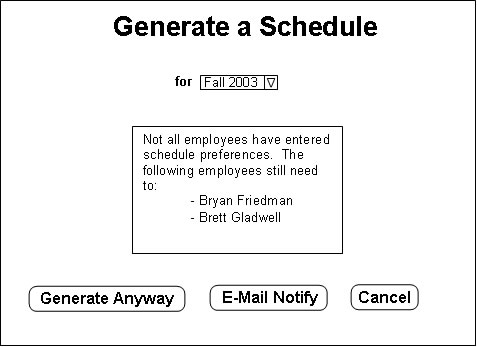
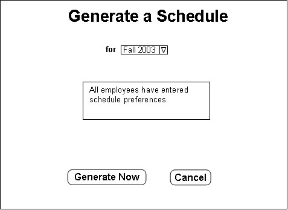
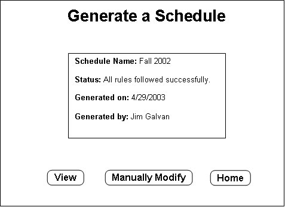
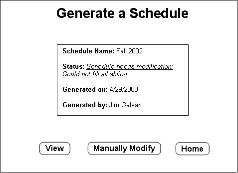

## 2.2.4. Generating a Schedule

This section discusses automatic schedule generation. The interface for doing this is very simple and is discussed first. After this, the way that the generation works is detailed.

When the "Generate Schedule" button is pressed on the menu, one of the following screens appear in the content frame:

The drop-down menu lets the user select the schedule that he/she would like to have generated. This menu lists all open schedules for which the start date has not been reached yet. After the start date has been reached, preferences cannot be entered by employees and that schedule can no longer be automatically generated. To change that schedule, manual adjustments must be made. This is discussed in the next section, [Section 2.2.5.](adjusting.md)

The user must select the schedule that he/she would like to generate from this drop-down menu. If all employees have entered schedule preferences, then the second screen above will be shown. Otherwise, the first screen will be shown.

The first screen has three buttons. The "Generate Anyway" button allows the user to generate the schedule even though not all preferences have been entered. This will still include all active employees in the system, but will not follow preferences for those who have not entered any. In other words, if an employee has not entered preferences, he/she is available to work whenever. The "E-Mail Notify" button will send a reminder e-mail to all employees who have not entered preferences yet. The "Cancel" button returns to the home page.

The second screen has only two buttons. The "Generate Now" button allows the user to generate the schedule. The "Cancel" button returns to the home page.

After either the "Generate Anyway" button or the "Generate Now" button has been clicked, the following screen will show up, displaying a report of the results of the generation:

There are three buttons on this page. The "Manually Modify" button takes the user to the interface to manually adjust the schedule. This is desirable when the report claims that not all shifts could be filled. See [Section 2.2.5.](adjusting.md) for details on manually adjusting schedules. The "View Schedule" button takes the user to the Schedule Viewing window. For details on this, see [Section 2.2.6.](admin-view-print.md) The "Home" button below the menu will return to the Home page.

Here are the details of how the schedule generation works. The generator tries to schedule all employees by following each employee's preferences, but still keeping with the schedule rules. Employees are scheduled in order of priority as defined by the Administrator (see [Section 2.2.2.](priorities.md)). Employees' "Preferred Hours" (see [Section 2.3.1](../employee/preferences.md)) are only followed when it is possible. In other words, "Preferred Hours" are where high priority employees get an advantage. "Availability", however, is always followed. If an employee is unavailable at a certain time, they will not be scheduled during that time, regardless of priority. This is where holes in the schedule can arise and require manual adjusting of the schedule to be done.

* * *
Prev: [new](new.md) | Next: [adjusting](adjusting.md) | Up: [administrator](administrator.md) | Top: [index](../../index.md)
* * *
