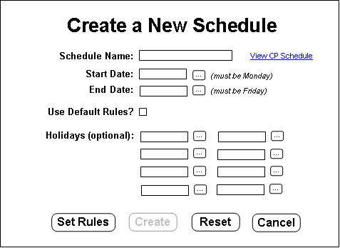
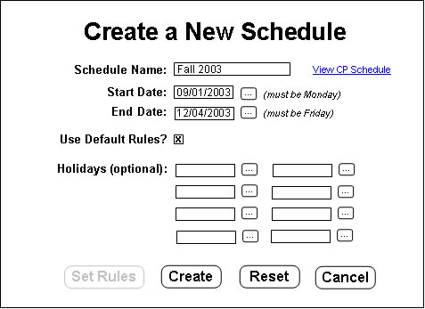
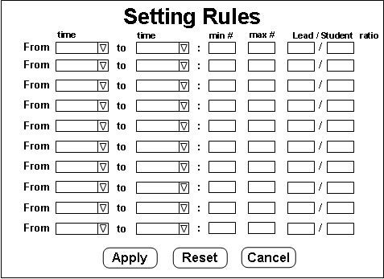

## 2.2.3. Creating a New (Open) Schedule

When the "New Schedule" button is pressed on the menu, the following screen appears in the content frame:

The fields on the Create a New Schedule form are as follows:

- The "Schedule Name" field is for the name of the schedule. This is just a label and is used as a title for this schedule. Something like "Fall 2004" or "Spring Break 2005" would be appropriate here.
- The "Start Date" and "End Date" fields are for specifying the beginning and ending dates for this schedule period. The "Start Date" must be a Monday and the "End Date" must be a Friday. The "..." button to the right of each field may be pressed to select a date from the calendar pop-up to populate that field. There is also a link to the Cal Poly Schedule page, which will open a new window and show Cal Poly's schedule for reference.
- The "Holidays" fields are for weekdays in which the Help Desk is not open. Dates can be entered in a similar fashion as in the "Start Date" and "End Date" fields. Entering holidays are optional. If no holidays are entered, all weekdays between "Start Date" and "End Date" will be included in the schedule when it is viewed, even if it is a day when the Help Desk is not open.
- The "Use Default Schedule Rules" checkbox is checked by default and specifies exactly what it says. If it is unchecked, then the "Create" button is disabled and the "Set Rules" button appears. (More details to follow.)
- The "Set Rules" button only appears when the "Use Default Schedule Rules" checkbox is unchecked. This button allows the user to set different rules than the default rules for this schedule only. For details about schedule rules, see the section [below](#2-2-3-1-setting-schedule-rules).

The "Create" button will be active if the "Use Default Schedule Rules" checkbox is checked. Otherwise the "Create button will appear on the "Setting Rules" screen as detailed [below](#2-2-3-1-setting-schedule-rules). This button will create a new open schedule and e-mail all students and lead students, letting them know to sign in and set schedule preferences so that the schedule can be generated. The "Reset" button will clear all the fields of the form, and the "Cancel" button will return to the home page. If any of the above requirements are not met, an error will appear upon submission and the data will need to be re-entered and the form resubmitted.

Here is an example of a properly filled out form:

### 2.2.3.1. Setting Schedule Rules

When the "Set Rules" button is clicked on the Create a New Schedule page, the following screen appears in the content frame:

A schedule may have up to ten rules associated with it. Each rule is entered on a row of the form shown above. The fields in each row are as follows:

- The "From" field is a pull-down menu from which a valid time may be selected. The "to" field is the same. This specifies the timespan for which this particular rule applies.
- The "min #" field specifies the minimum number of total students that must be scheduled during the specified time frame.
- The "max #" field specifies the maximum number of total students that are allowed to be scheduled during the specified time frame.
- The "Lead / Student ratio" field specifies the minimum ratio of Leads to Non-Lead students taht must be scheduled during the specified time frame. (In other words, if the minimum is 3 and you want a minimum of one lead and two non-leads, the ratio would be 1/2.)

The "Apply" button is used to submit the form and set the rules. The "Reset" button will clear all the fields of the form, and the "Cancel" button will return to the Main Account page. If any of the field requirements are not met, an error will appear upon submission and the data will need to be re-entered and the form resubmitted.

### 2.2.3.2. Setting Default Schedule Rules

When the "Default Rules" button is clicked on the Main page menu, an identical screen as the one described [above](#2-2-3-1-setting-schedule-rules) (except for the title) appears. The only real difference is that when the "Apply" button is pressed, the *default* rules for schedules are changed. These will apply to schedules generated after this change, included schedules that have already been created, but not ones that have already been generated.

* * *
Prev: [priorities](priorities.md) | Next: [generating](generating.md) | Up: [administrator](administrator.md) | Top: [index](../../index.md)
* * *
