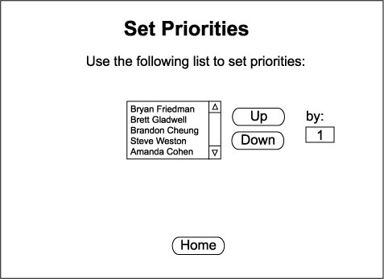

## 2.2.2. Setting Priorities

Priorities are used when automatically generating a schedule. This section discusses how to rank user priorities. For details on how this affects schedule generation, see [Section 2.2.4.](generating.md)

When the "Priorities" button is pressed on the menu, the following screen appears in the content frame:

The menu is a list of full names for all student and lead student accounts currently in the database. This list is the priority list. The user listed first has first priority, and so on.

To change a user's priority, you must select a name and use the buttons to the right of the menu to move the user up or down on the priority list by a specified amount. The buttons do exactly as they say, move the user up or down by the amount specified in the "by" field. This amount is 1 by default, but can be changed before pressing the button. When the up or down button is pressed, the page will reload with the new priority list and the "by" amount will be reset to 1.

The "Home" button below the menu will return to the Home page.

* * *
Prev: [accounts](accounts.md) | Next: [new](new.md) | Up: [administrator](administrator.md) | Top: [index](../../index.md)
* * *
