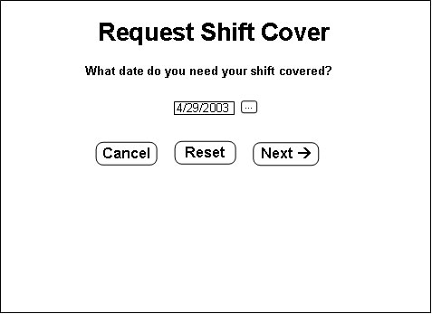
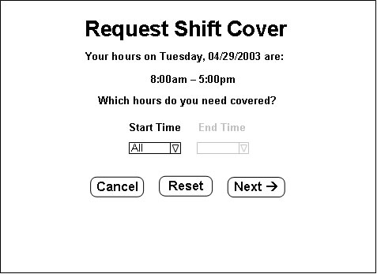
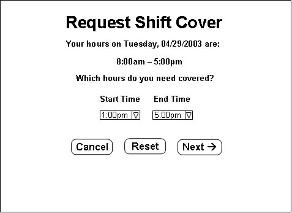
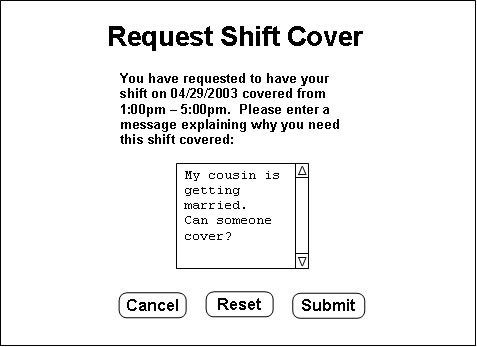
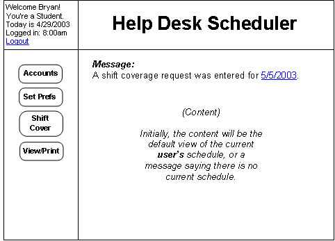
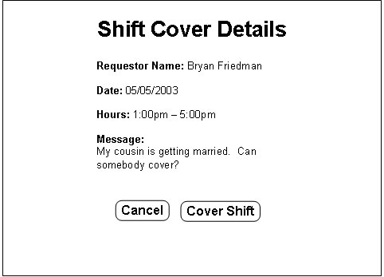

## 2.3.3. Handling Shift Covering

Shift covering allows an employee to request that someone cover a shift for them on a specific day, and allows other employees to respond to this request, altering the schedule for that particular day (replacing the requestor with the responder). When the "Shift Cover" button is clicked on the main home page, the following screen appears in the content frame:

This is a list of current requests for shift cover. It may be empty, meaning there are no requests. If there is a request, clicking the "Details" button to the right of it will show you the details of a request, allowing you to respond. Details about this are described below in [Section 2.3.3.2](#2-3-3-2-responding-to-a-shift-cover-request). Clicking the "Cancel" button will return to the main home page. Clicking the "Enter Request" button will allow you to enter a request as described below in [Section 2.3.3.1](#2-3-3-1-requesting-a-shift-cover).

### 2.3.3.1. Requesting a Shift Cover

When the "Enter Request" button is clicked on the Shift Cover Requests page, the following screen appears in the content frame:

This allows the user to enter the desired date to be covered. The "Cancel" and "Reset" buttons work as usual, and the "Next -&gt;" button takes the user to the following screen:

This page shows when the employee is working on the day entered on the previous page. (If the employee is not scheduled on that day, the screen will say so and return to the Request Shift Cover page to enter a different date.) The user needs to select the hours that he/she would like covered. Only the hours that he/she is working will show up in the menus. If the entire shift should be covered, the start time should be "All" and the end time will be grayed out. Otherwise, both a start and end time should be entered, like this:

The "Cancel" and "Reset" buttons work as usual and the "Next -&gt;" button will take the user to the following page:

This is where the employee can enter a reason that his/her shift needs to be covered. After the reason message is entered, the "Submit" button will enter the request into the system and return to the main home page. The "Cancel" and "Reset" buttons work as usual.

### 2.3.3.2. Responding to a Shift Cover Request

Shift Cover Requests can be responded to in two ways. One way is by clicking the "Shift Cover" button on the main page and viewing the list of requests, then clicking the "Details" button for that specific request (as in the picture [above](#2-3-3-handling-shift-covering)). The other way can be reached by a link that will show up on the main home page when a request is entered. After a request is entered, the main home page will look like this:

Clicking the date will bring you to the details page for that request, just like clicking the "Details" button next to the request on the request list. A Shift Cover details page looks like this:

This page lists the details of the request and allows the employee to respond to the request by clicking the "Cover Shift" button. Clicking this button will change the schedule to replace the requestor with the responder, e-mail the Administrator, the requestor, and the responder about the schedule change, and then remove the request from the system. The "Cancel" button works as usual.

* * *
Prev: [password](password.md) | Next: [view-print](emp-view-print.md) | Up: [employee](employee.md) | Top: [index](../../index.md)
* * *
