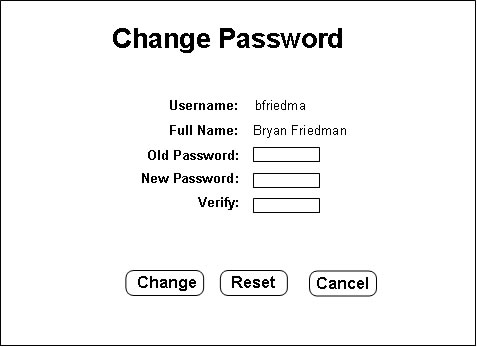

## 2.3.2. Changing Account Password

When the "Accounts" button is pressed on the menu, the following screen appears in the content frame:

This screen will allow a user to change his/her password. First, the old password must be entered once, then the new password must be entered twice. The "Change" button will change the password and return to the home page. The "Cancel" button returns to the home page without changing the passsword, and the "Reset" button will clear all fields.

Lead students have the ability to change more passwords. They have sort of mixed privileges, somewhere between a student and an administrator. See [Section 2.4](../privileges/privileges.md) for details about account privileges.

* * *
Prev: [preferences](preferences.md) | Next: [covering](covering.md) | Up: [employee](employee.md) | Top: [index](../../index.md)
* * *
