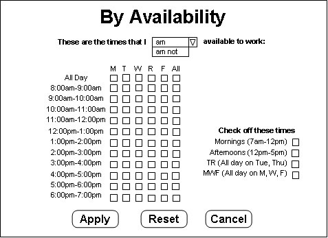
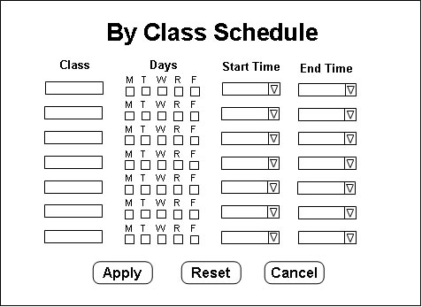
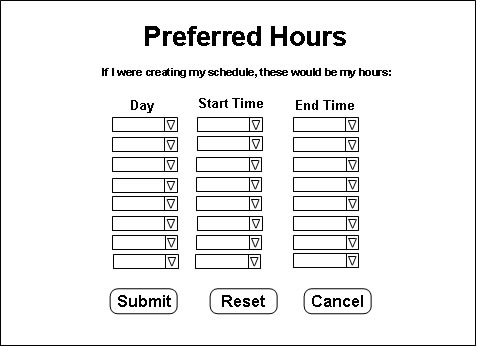

## 2.3.1. Entering Schedule Preferences

Schedule preferences are used by the system when automatically generating a schedule. This section discusses how to set schedule preferences for an employee. Each employee can set his/her own preferences. For details on how this affects schedule generation, see [Section 2.2.4.](../administrator/generating.md)

When the "Set Preferences" button is pressed on the menu, the following screen appears in the content frame:

The first field is for selecting which schedule to enter preferences for. The next fields are for entering the desired hours per week range. This is used when automatically generating a schedule. The schedule will never schedule more hours than the maximum hour value entered here, and it will try to always schedule at least the minimum number of hours requested (it will either do it, or get as close as possible).

After entering the desired number of hours, one of the buttons must be pressed to enter availability. The "Availability" button allows the user to enter times that he/she is or is not available. Pressing this button will bring up the following screen in the content frame:

This interface works similarly to the interface on POWER (Cal Poly's class scheduler). The first line lets you set whether these are the hours that you are available, or not available. Each checkbox on the grid represents an hour block of time. The checkboxes to the right will block off multiple checkboxes on the grid as described by the labels. When everything is entered, the "Apply" button will continue to the "Preferred Hours" page. The "Cancel" button returns to the home page, and the "Reset" button will clear all fields.

Rather than entering availability this way, an employee may wish to simply enter his/her class schedule by using the "Class Schedule" button on the main "Entering Schedule Preferences" page instead of the "Availability" button. Pressing this button will bring up the following screen in the content frame:

This lets you enter a number of classes by entering the class name, days that the class meets, and a starting and ending time for each class. Each class is specified by one row of fields. The nice thing about this feature is that it will include the class in the user's individual schedule so that when his/her schedule is viewed, the classes will show up along with work hours. However, if things other than class make an employee unavailable, he/she should either use the "Availability" button or enter these activities as if they are classes. When everything is entered, the "Apply" button will continue to the "Preferred Hours" page. The "Cancel" button returns to the home page, and the "Reset" button will clear all fields.

After hitting the "Apply" button on one of the two availability pages, the "Preferred Hours" screen will show up in the content frame. It looks like this:

This allows the user to enter his/her preferred weekly schedule. The first field is for the day of the week, the second two fields specify start and end times. There should be no overlap, but multiple shifts may be specified for the same day (e.g. Monday 8-12 and Monday 2-5). These hours are the first thing looked at by the automatic schedule generator when trying to fill a shift. Higher priority employees will have the better chance of receiving these preferred hours. When everything is entered, the "Submit" button will submit all of the data and return to the home page. The "Cancel" button returns to the home page without entering any data (including availability from the previous page), and the "Reset" button will clear all fields.

* * *
Prev: \[none] | Next: [password](password.md) | Up: [employee](employee.md) | Top: [index](../../index.md)
* * *
